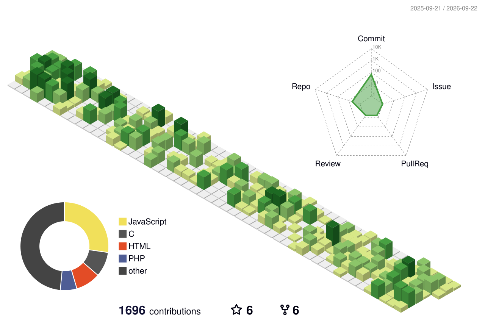

<div align="center">


[](https://linkedin.com/in/miftakhuddin-falaki)
[](https://ko-fi.com/kikukeii)

</div>

---

## 💫 About Me

Love **You**

```sql
SELECT p.*, c.country_name, ct.contact_info
FROM peopleMaster p
LEFT JOIN countryMaster c ON p.country_id = c.id
LEFT JOIN contactMaster ct ON p.id = ct.person_id
WHERE p.id IN (
    SELECT DISTINCT p.id
    FROM peopleMaster p
    JOIN skills s ON p.id = s.person_id
    WHERE p.job_title IN ('Full Stack Developer', 'Web Developer', 'Backend Developer')
       OR s.skill_name IN ('PHP', 'Javascript', 'Codeigniter 4', 'Laravel', 'Express js', 'Nodejs')
)
AND p.status = 'available';
```

```json
{
  "status": "success",
  "message": "You found me! Here's what I know."
}
```

---

## 💻 Tech Stack

<p align="center">
  
  
  
  
  
</p>

<p align="center">
  
  
  
  
</p>

<p align="center">
  
  
  
  
  
  
  
  
</p>

---

## ✍️ My Blog

<span>
    <a target="_blank" href="https://blog.kiki.my.id/card-latest.html?post=1"></a>
    <a target="_blank" href="https://blog.kiki.my.id/card-latest.html?post=2"></a>
    <a target="_blank" href="https://blog.kiki.my.id/card-latest.html?post=3"></a>
    <a target="_blank" href="https://blog.kiki.my.id/card-latest.html?post=4"></a>
</span>

---

## 📊 GitHub Stats

<p align="center">
 
</p>

<p align="center">

</p>

---

## 🤖 GitHub Contribution Graph

<p align="center">
  <picture>
    <source media="(prefers-color-scheme: dark)" srcset="profile-3d-contrib/profile-night-green.svg" />
    <source media="(prefers-color-scheme: light)" srcset="profile-3d-contrib/profile-green-animate.svg" />
    
  </picture>
</p>
