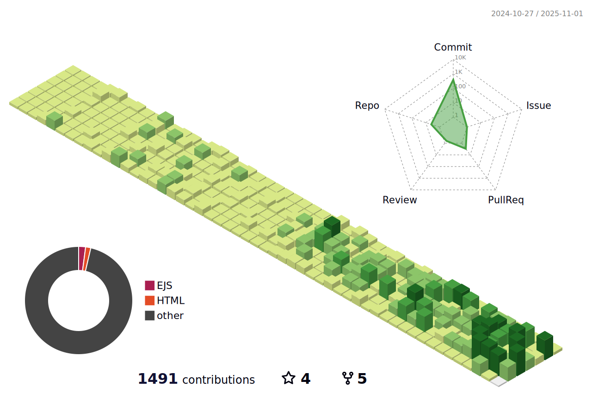

<a href="https://github.com/kikukeii"></a>

###  ꝗᵾɇɍɏ
```sql
SELECT *
FROM world
WHERE theRightPersonForYourJob LIKE 'Programmer'
   OR theRightPersonForYourJob LIKE 'Backend'
   OR theRightPersonForYourJob LIKE 'Web Developer'
   OR theRightPersonForYourJob LIKE 'Codeigniter'
   OR theRightPersonForYourJob LIKE 'Laravel'
   OR theRightPersonForYourJob LIKE 'Express js';

```

<details>
   <summary>↲ results ⟪12/01/2024⟫  </summary>
  
```
  _   _      _ _        __        __         _     _   _   _   _ 
 | | | | ___| | | ___   \ \      / /__  _ __| | __| | | | | | | |
 | |_| |/ _ \ | |/ _ \   \ \ /\ / / _ \| '__| |/ _` | | | | | | |
 |  _  |  __/ | | (_) |   \ V  V / (_) | |  | | (_| | |_| |_| |_|
 |_| |_|\___|_|_|\___/     \_/\_/ \___/|_|  |_|\__,_| (_) (_) (_)
                                                                 
                                                                                                                  
```


<h1 align="center">Hi 👋, I'm Miftakhuddin Falaki</h1>

<h3 align="center"><a href="#"></a></h3> 

<details open>
   <summary><h3>About</h3></summary>
  
👋 Hello! I am Miftakhuddin Falaki, a computer science graduate and web developer with a strong passion for creating creative solutions in the world of technology. With expertise in the Laravel and CodeIgniter 4 frameworks, as well as experience in Express.js, React.js, Next.js, Astro.js, and Jekyll, I am ready to bring innovation to every project. 

💻 Proficient in programming languages such as PHP, SQL, and JavaScript, and experienced in using Rest API, I have successfully developed applications that are not only efficient but also aesthetic. My high learning speed allows me to continuously adapt to the latest technological advancements.

🤝 Additionally, my collaborative skills enable me to work well in teams, contributing maximally to achieve common goals. Explore my portfolio at https://kiki.my.id and https://github.com/kikuKeii?tab=repositories.

📧 If you have any opportunities or interesting projects, let's communicate at kiki@devkikinian.click. I am very enthusiastic about collaborating and bringing creative ideas to life. Let's together create positive change in the world of technology!

🔧 #WebDeveloper #TechEnthusiast #Innovation #Laravel #CodeIgniter #ReactJS #NextJS #ExpressJS #AstroJS #Jekyll

I <strike>hate</strike> Love codding.

</details>


---

### 💻 Tech Stack:
                         

---

### 👾 Most used languages & 🔝 Top Contributed Repo

<picture>
  <!-- Dark mode -->
  <source media="(prefers-color-scheme: dark)" srcset="https://github-readme-stats.vercel.app/api/top-langs/?username=kikukeii&theme=algolia&hide_border=true&langs_count=5" />
  
  <!-- Light mode -->
  <source media="(prefers-color-scheme: light)" srcset="https://github-readme-stats.vercel.app/api/top-langs/?username=kikukeii&theme=flat&hide_border=true&langs_count=5" />
  
  <!-- Default fallback -->
  
</picture>

<picture>
  <!-- Dark mode -->
  <source media="(prefers-color-scheme: dark)" srcset="https://github-contributor-stats.vercel.app/api?username=kikukeii&limit=5&theme=algolia&combine_all_yearly_contributions=true" />
  
  <!-- Light mode -->
  <source media="(prefers-color-scheme: light)" srcset="https://github-contributor-stats.vercel.app/api?username=kikukeii&limit=5&theme=flat&combine_all_yearly_contributions=true" />
  
  <!-- Default fallback -->
  
</picture>

---
### 🌐 Socials:
[](https://linkedin.com/in/miftakhuddin-falaki)  <a href="https://twitter.com/kikukeii_" target="blank"></a>
---

<h3 align="left">💳 Support:</h3>
<p><a href="https://ko-fi.com/kikukeii"> </a></p><br><br>

---

### 🤖 Github Contribution

<picture>
  <!-- Dark mode -->
  <source media="(prefers-color-scheme: dark)" srcset="profile-3d-contrib/profile-night-green.svg" />
  
  <!-- Light mode -->
  <source media="(prefers-color-scheme: light)" srcset="profile-3d-contrib/profile-green-animate.svg" />
  
  <!-- Default fallback -->
  
</picture>

</details>
